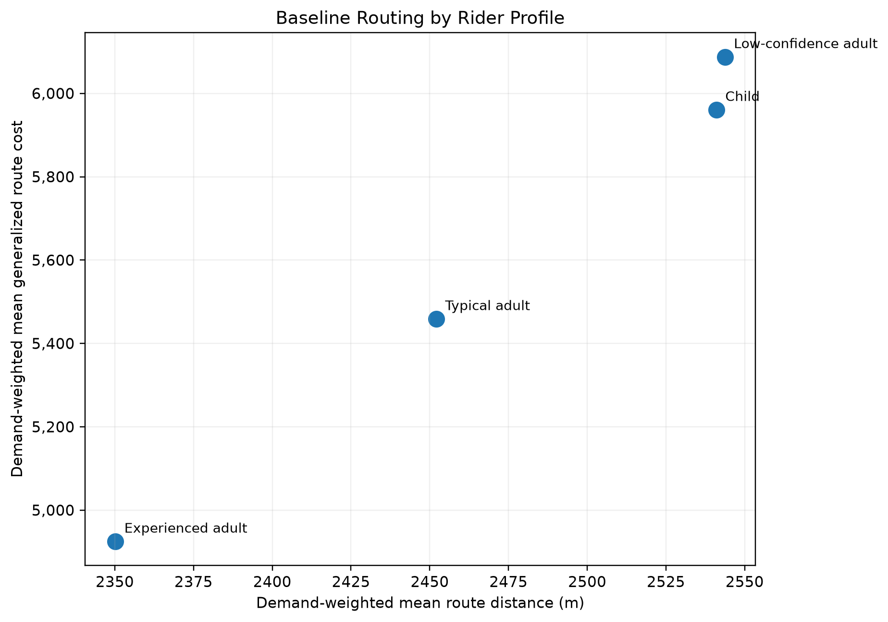
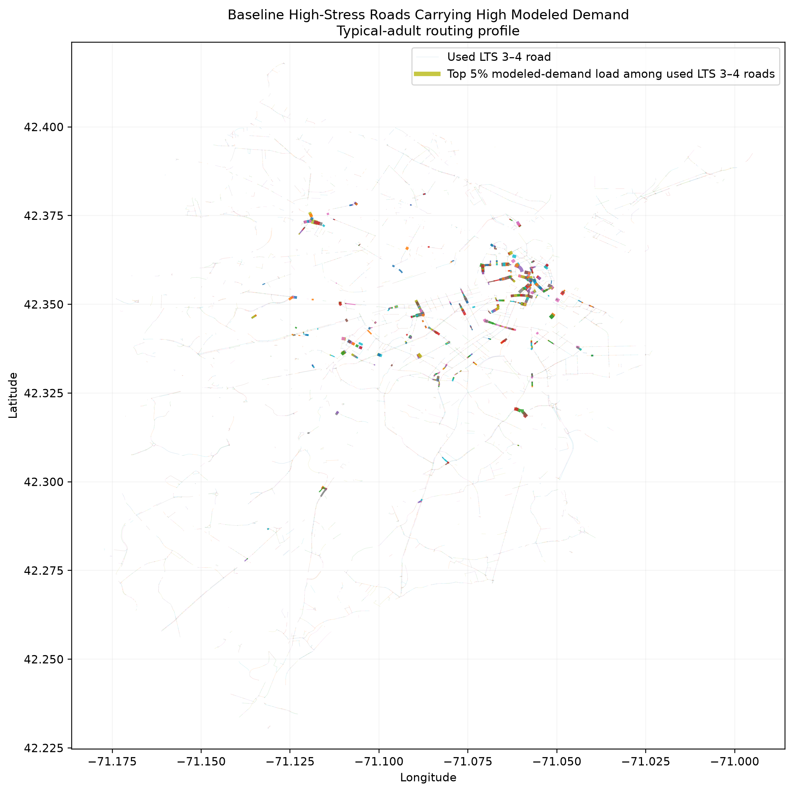
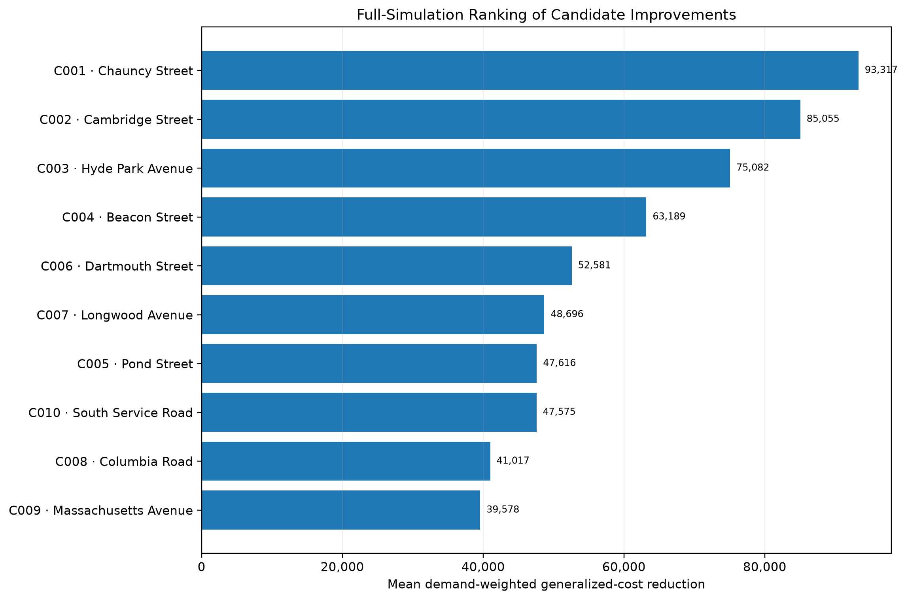
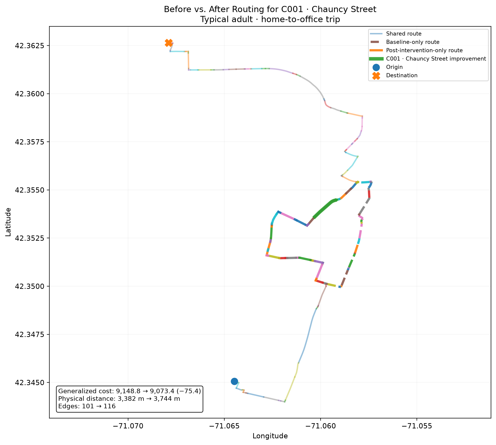
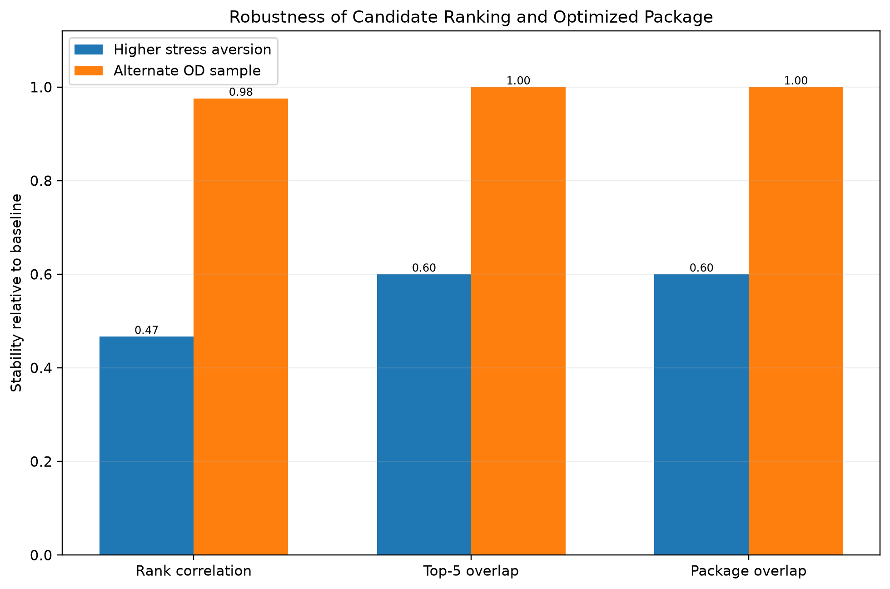

# Identifying High-Impact Bicycle Network Improvements

COMPSCI 683 — Artificial Intelligence
University of Massachusetts Amherst

## Overview

This project develops a graph-based framework for identifying high-impact bicycle infrastructure improvements in Greater Boston.

Rather than ranking stressful streets in isolation, the method evaluates how improving a road segment changes bicycle routes across the network. It combines:

* Level of Traffic Stress (LTS)
* modeled origin-destination demand
* rider-specific stress preferences
* Uniform-Cost Search (UCS)
* A* search
* before/after network intervention simulation
* greedy multi-project optimization
* robustness analysis

The central research question is:

> **Which bicycle-network infrastructure improvements produce the greatest modeled reduction in travel stress for riders in Greater Boston?**

## Main Result

The baseline optimization selected the following five-project package:

1. **C001 — Chauncy Street**
2. **C002 — Cambridge Street**
3. **C003 — Hyde Park Avenue**
4. **C004 — Beacon Street**
5. **C006 — Dartmouth Street**

The package produced a mean demand-weighted generalized-cost reduction of approximately:

**361,774**

across the four modeled rider profiles.

Its cumulative candidate length was approximately:

**779.67 meters**


## Why Generalized Cost?

Shortest physical distance alone does not represent bicycle route preference well because cyclists may choose longer routes to avoid stressful roads.

For edge \(e\):

$$
\mathrm{Cost}(e)
=
\mathrm{Length}(e)
\times
\mathrm{StressWeight}(\mathrm{LTS}(e))
$$

Four rider profiles are modeled:

* Child
* Low-confidence adult
* Typical adult
* Experienced adult

More stress-sensitive riders assign higher penalties to LTS 3 and LTS 4 roads.



## Data

The street network is derived from OpenStreetMap. Level of Traffic Stress (LTS) values are computed from roadway attributes using the StressMap methodology and associated LTS rules. The network is represented as a directed graph in which roadway segments have physical lengths, traffic-stress characteristics, and rider-specific generalized traversal costs.

The fixed modeled-demand dataset contains 50,000 trips across employment, school, healthcare, transit, greenspace, and store categories. Employment demand is derived from Census LODES origin-destination data. For non-employment demand, origins are sampled using population-weighted nodes across the four-municipality Greater Boston study area (Boston, Cambridge, Somerville, and Brookline), while destinations are derived from OpenStreetMap points of interest.

The simplified routing graph contains approximately:

* **98,168 nodes**
* **279,932 directed edges**

The modeled demand dataset contains approximately:

* **42,294 OD records**
* **50,000 total modeled demand units**
* **45,568 routed demand units**
* **91.1% demand-weighted routing success**

Demand includes trips to categories such as:

* employment
* schools
* healthcare
* transit
* greenspace
* stores

## Routing

Both UCS and A* were implemented and benchmarked.

On the routing benchmark:

* both algorithms returned the same optimal route costs for routable OD pairs;
* A* generally expanded fewer nodes;
* A* generally ran faster while preserving optimality.

### UCS vs. A* Validation

A deterministic 100-pair benchmark verified both correctness and search efficiency.

| Metric | UCS | A* | A* reduction |
|---|---:|---:|---:|
| Routable pairs | 93 | 93 | — |
| Mean runtime | 0.05885 s | 0.05175 s | 12.1% |
| Median runtime | 0.02056 s | 0.01099 s | 46.5% |
| Mean nodes expanded | 19,799.55 | 12,033.43 | 39.2% |
| Median nodes expanded | 8,349 | 2,922 | 65.0% |
| Mean routable route cost | 6,965.06 | 6,965.06 | 0% |

Five representative benchmark routes ranging from approximately 8 m to 12.26 km were also inspected at the full path-sequence level. In all five cases, UCS and A* produced identical generalized cost, physical distance, node sequence, and directed-edge sequence.

Detailed validation artifacts are available in:

```text
results/routing/ucs_astar_validation_summary.csv
results/routing/manual_route_checks.csv
results/routing/manual_route_path_checks.csv
results/routing/manual_route_path_checks.md
```

For the full experiments, one-to-many routing was used to efficiently evaluate many destination records from the same origin.

### High-Stress / High-Use Baseline Map



The typical-adult baseline contains 13,696 used LTS 3–4 directed edges. Figure 7 emphasizes segments at or above the 95th percentile of baseline modeled edge use (`path_count >= 136`), yielding 690 highlighted directed edges representing 654 physical edge pairs.

## Candidate Generation

Candidate screening was restricted to homogeneous LTS 3–4 simplified segments. Most shortlist positions were assigned using preliminary demand-weighted stress benefit, while a five-position connectivity reserve ensured that direct bridges between distinct LTS 1–2 network components were also considered.

Twenty candidates were retained, and the strongest ten were evaluated using full intervention simulations.

For each candidate:

1. its LTS was reduced to 2;
2. rider-specific edge costs were updated;
3. the full modeled demand set was rerouted;
4. new routes were compared with baseline routes;
5. demand-weighted generalized-cost reduction was calculated.

## Top Individual Interventions

| Rank | Candidate | Location             | Mean generalized-cost reduction |
| ---: | --------- | -------------------- | ------------------------------: |
|    1 | C001      | Chauncy Street       |                       93,316.79 |
|    2 | C002      | Cambridge Street     |                       85,055.17 |
|    3 | C003      | Hyde Park Avenue     |                       75,082.18 |
|    4 | C004      | Beacon Street        |                       63,188.53 |
|    5 | C006      | Dartmouth Street     |                       52,581.37 |
|    6 | C007      | Longwood Avenue      |                       48,695.65 |
|    7 | C005      | Pond Street          |                       47,615.96 |
|    8 | C010      | South Service Road   |                       47,575.31 |
|    9 | C008      | Columbia Road        |                       41,016.96 |
|   10 | C009      | Massachusetts Avenue |                       39,577.98 |



### Before-and-After Route Example



For one actual typical-adult home-to-office OD record affected by **C001 — Chauncy Street**, generalized route cost decreases from **9,148.81 to 9,073.39** after intervention. The preferred route changes from **3,381.89 m / 101 edges** to **3,744.08 m / 116 edges**.

The example demonstrates an important feature of the model: the preferred post-intervention route can be physically longer while still having lower generalized cost because it provides a less stressful route.

## Greedy Optimization

Simply selecting the five strongest individual projects would assume that intervention benefits are independent.

Instead, the project uses greedy optimization.

At every round:

1. each remaining candidate is added temporarily to the existing package;
2. the full OD set is rerouted;
3. the total package benefit is recomputed;
4. marginal benefit is calculated;
5. the highest-marginal-benefit candidate is selected.

### Optimization Constraint

The original proposal contemplated either a project-count limit or a cumulative improved-road-length limit. The final implementation uses a **maximum-five-project constraint**.

A hard road-length budget was not imposed because physical length alone is not a reliable proxy for construction cost. Projects of equal length can differ substantially in intersection treatment, right-of-way requirements, engineering complexity, and construction requirements. Cumulative candidate length is therefore reported descriptively and used only as a secondary tie-breaker.

The final sequence was:

| Step | Candidate | Total package benefit | Marginal benefit |
| ---: | --------- | --------------------: | ---------------: |
|    1 | C001      |             93,316.79 |        93,316.79 |
|    2 | C002      |            178,121.57 |        84,804.78 |
|    3 | C003      |            253,261.05 |        75,139.48 |
|    4 | C004      |            308,539.49 |        55,278.44 |
|    5 | C006      |            361,774.05 |        53,234.57 |

## Effects by Rider Profile

The final package benefits stress-sensitive riders most strongly.

| Rider profile        | Generalized-cost reduction | Improved modeled demand |
| -------------------- | -------------------------: | ----------------------: |
| Child                |                 524,364.96 |                   2,642 |
| Low-confidence adult |                 483,479.57 |                   2,648 |
| Typical adult        |                 320,866.11 |                   2,342 |
| Experienced adult    |                 118,385.58 |                   1,995 |

Physical route-distance changes were very small.

This indicates that the main modeled benefit is **reduced travel stress rather than shorter travel distance**.

## Robustness

Two robustness experiments were performed.

### Alternate OD Sample

A second independently generated fixed OD sample using seed 684 was compared with the fixed baseline OD sample.

Results were highly stable:

* Spearman rank correlation: **0.976**
* Top-5 candidate overlap: **5/5**
* Optimized-package overlap: **5/5**
* Final optimized package: exactly the same as baseline
* Final benefit change: approximately **-0.137%**

### Higher Stress Aversion

More strongly stress-averse rider profiles were also tested.

Results were more sensitive:

* Spearman rank correlation: **0.467**
* Top-5 candidate overlap: **3/5**
* Optimized-package overlap: **3/5**

The high-aversion optimized package was:

**C001 + C006 + C002 + C005 + C008**

Three projects remained common to both optimized packages:

* C001
* C002
* C006



## Interpretation

The results suggest three main conclusions.

First, bicycle-infrastructure value is a network effect. Local demand or LTS alone does not determine the value of an intervention.

Second, the baseline optimized package remained stable under the independent alternate OD sample tested.

Third, infrastructure rankings depend materially on assumptions about rider stress sensitivity. More strongly stress-averse riders shift the relative importance of several projects.

## Limitations

Important limitations include:

* demand is modeled rather than directly observed;
* interventions are modeled as reducing existing-edge LTS to 2;
* no construction-cost model is included;
* optimization is constrained to five projects rather than a monetary budget;
* network topology remains fixed;
* rider preferences are represented by predefined LTS weights;
* optimization occurs within the generated candidate set rather than over every possible infrastructure project.

## Repository Structure

```text
configs/
    Experiment configurations

scripts/
    Experiment entry points, Slurm jobs,
    result collection, robustness analysis,
    and figure generation

src/network_analysis/
    Network construction, LTS processing, Census integration,
    destination processing, OD-demand generation, and road-usage utilities

src/bike_improvements/
    COMPSCI 683 project-specific implementation

tests/
    Automated tests

results/
    Baseline, candidate, intervention,
    optimization, routing, and robustness results

reports/
    Final report and figures
```

## Reproducing the Analysis

Run the automated tests with:

```bash
pytest -q
```

Scripts that access external project-data directories use `BIKE_DATA_ROOT`, `BIKE_FINAL_ROOT`, and `BIKE_COURSE_ROOT`. A template is provided in `.project_env.example`:

```bash
cp .project_env.example .project_env
# Edit .project_env with the correct local data root.
source .project_env
```

The local `.project_env` file is intentionally excluded from version control.

Report Figures 1–6 can be regenerated from the committed result tables with:

```bash
python scripts/create_final_figures.py
```

Figures 7–8 use stored project-data artifacts configured through `BIKE_COURSE_ROOT` and are generated with:

```bash
source .project_env
python scripts/create_proposal_visuals.py
```

Key result tables are stored under:

```text
results/baseline/
results/candidates/
results/interventions/
results/optimization/
results/robustness/
results/routing/
```

The full report is available at:

```text
reports/final_report.md
```

## Final Optimized Package

**C001 — Chauncy Street**
**C002 — Cambridge Street**
**C003 — Hyde Park Avenue**
**C004 — Beacon Street**
**C006 — Dartmouth Street**

The experiments indicate that this package provides strong modeled network-wide benefit across rider profiles and was reproduced exactly under the independent alternate OD sample tested.
