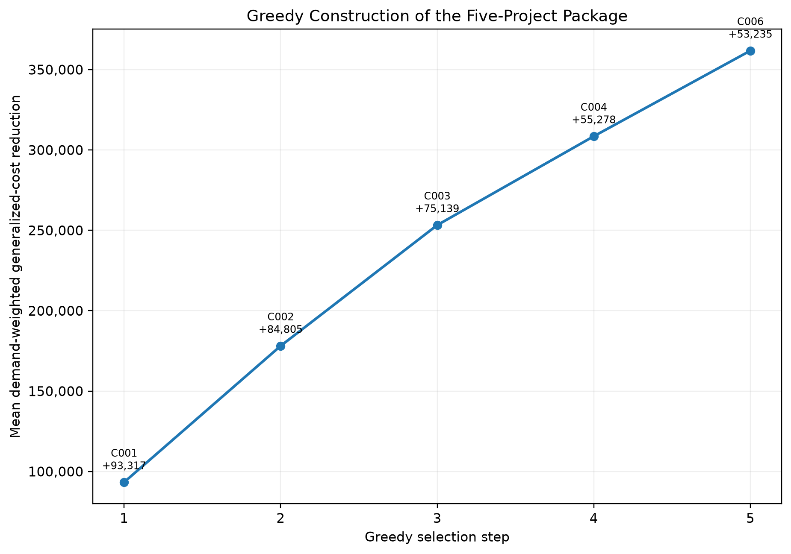

# Identifying High-Impact Bicycle Network Improvements

COMPSCI 683 - Artificial Intelligence
University of Massachusetts Amherst

## Overview

This project develops a graph-based framework for identifying high-impact bicycle infrastructure improvements in Greater Boston. It combines Level of Traffic Stress (LTS), modeled origin-destination demand, rider-specific routing costs, shortest-path search, full before-and-after intervention simulation, greedy multi-project selection, and robustness analysis.

The central research question is:

> **Which bicycle-network infrastructure improvements produce the greatest modeled reduction in travel stress for riders in Greater Boston?**

## Main Result

The baseline optimization selected five modeled candidate segments:

1. C001 - Chauncy Street
2. C002 - Cambridge Street
3. C003 - Hyde Park Avenue
4. C004 - Beacon Street
5. C006 - Dartmouth Street

Together, the selected segments total approximately 779.67 meters. The package produced a mean demand-weighted generalized-cost reduction across the four modeled rider profiles of approximately 361,774.



## Method at a Glance

- Directed Greater Boston bicycle-routing graph
- Rider-specific generalized edge cost: physical length × LTS weight
- Four rider profiles
- UCS and A* validation
- 50,000 modeled trips
- Twenty screened candidate improvements
- Ten full before-and-after intervention simulations
- Greedy selection of up to five projects
- Robustness checks using an alternate OD sample and stronger rider stress aversion

## Documentation

The extended methodology, results, limitations, and reproducibility details are in:

- [`docs/technical_report.md`](docs/technical_report.md)
- [`SOFTWARE_PROVENANCE.md`](SOFTWARE_PROVENANCE.md)

The course-required four-page written report is submitted separately and is not stored as the repository's technical report.

## Repository Structure

```text
configs/                 Experiment configuration
docs/                    Extended technical documentation
scripts/                 Experiment and figure-generation scripts
src/network_analysis/    Reused/adapted network and demand utilities
src/bike_improvements/   COMPSCI 683 project-specific analyses
tests/                   Automated tests
results/                 Committed aggregate experiment outputs
figures/         Generated figures
```

## Key Results

```text
results/baseline/
results/candidates/
results/interventions/
results/optimization/
results/robustness/
results/routing/
```

Detailed UCS/A* route checks are available in:

```text
results/routing/ucs_astar_validation_summary.csv
results/routing/manual_route_checks.csv
results/routing/manual_route_path_checks.csv
results/routing/manual_route_path_checks.md
```

## Running the Tests

```bash
python -m pip install -e ".[test]"
pytest -q
```

The final validation run contained 20 passing tests.

## Reproducing Figures

Figures derived from committed result tables are generated with:

```bash
python scripts/create_final_figures.py
```

The high-stress/high-use network map and before/after route example require the separately stored project-data artifacts:

```bash
source .project_env
python scripts/create_proposal_visuals.py
```

Scripts that use external project data rely on `BIKE_DATA_ROOT`, `BIKE_FINAL_ROOT`, and `BIKE_COURSE_ROOT`. See `.project_env.example` for the expected environment-variable setup.

## Data and Reproducibility Note

Large source and intermediate graph/data artifacts are not committed to the repository. Aggregate result tables, validation outputs, configuration, tests, and visualization scripts are committed. A complete rerun from the large source artifacts requires the separately stored project-data directory.

The fixed baseline OD table is treated as the experimental input because the historical random seed that created that particular baseline sample is not known. The alternate robustness sample was generated separately with seed 684.
