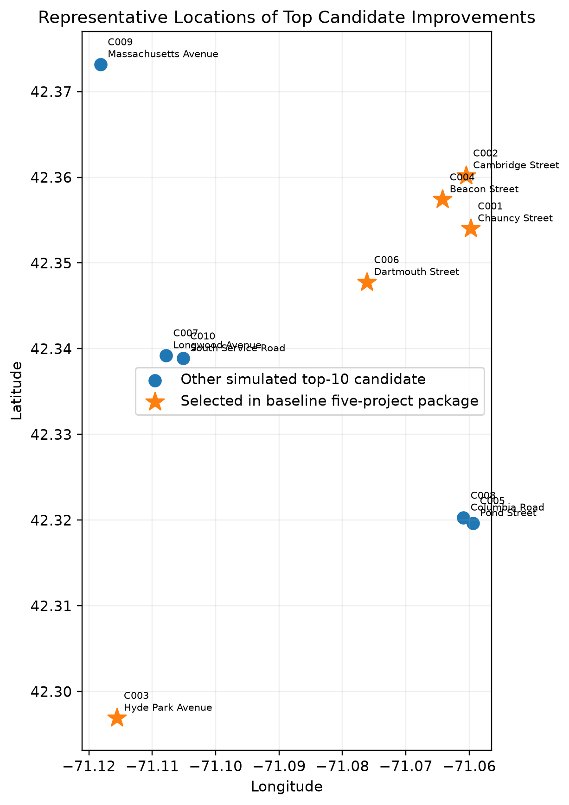
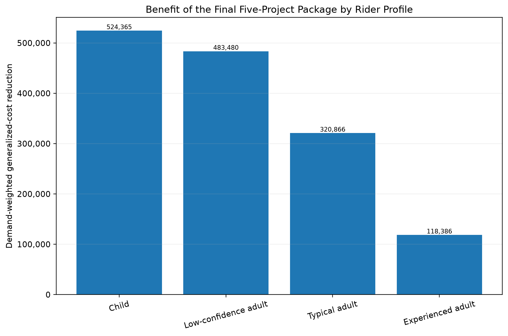

# Identifying High-Impact Bicycle Network Improvements

**Extended Technical Report**

**Kinjal Pandey**
**COMPSCI 683: Artificial Intelligence**
**University of Massachusetts Amherst**

## Abstract

This project evaluates which bicycle-network improvements provide the greatest modeled reduction in travel stress across Greater Boston. I combined a directed Level of Traffic Stress network with 50,000 modeled trips, four rider profiles, shortest-path search, before-and-after intervention simulation, and greedy project selection. Twenty high-stress candidate segments were screened and ten were fully simulated. The final five-project package selected segments on Chauncy Street, Cambridge Street, Hyde Park Avenue, Beacon Street, and Dartmouth Street. The package was stable under an alternate demand sample but changed more substantially when stronger rider stress-aversion assumptions were used.

## 1. Introduction

The goal of this project was to identify bicycle infrastructure improvements that could make a meaningful difference to routes available to cyclists in Greater Boston. A road can be stressful to bike on without necessarily being the best place to invest in an improvement. Its importance also depends on where it sits in the network, how much modeled travel demand passes through the area, whether lower-stress alternatives already exist, and what kinds of riders are being considered.

The main question I studied was:

**Which bicycle-network infrastructure improvements produce the greatest modeled reduction in travel stress for riders in Greater Boston?**

The project builds on earlier work I did with the Boston Cyclists Union and its StressMap-related analysis tools. StressMap assigns roadway segments a Level of Traffic Stress, or LTS, based on characteristics such as road type, speed, lane configuration, parking, and bicycle infrastructure. LTS 1 represents relatively low-stress conditions, while LTS 4 represents roads that are generally much less comfortable for anyone other than confident cyclists.

Some of the underlying data and network tools came from that earlier BCU work. These included OpenStreetMap network construction, LTS processing, Census population assignment, destination extraction, modeled demand generation, one-to-many Dijkstra routing, road-use calculations, and preliminary corridor analysis.

For COMPSCI 683, I built the intervention-analysis portion of the project. This included the rider-profile experiments, independent UCS and A\* implementations and validation, candidate improvement generation, full before-and-after simulations, demand-weighted intervention scoring, greedy multi-project selection, and robustness analysis.

The repository's `SOFTWARE_PROVENANCE.md` gives the detailed software attribution. It identifies the reused BCU Graph Analysis components as coming from its `main` branch in August 2026 and separately lists the analyses developed specifically for this course project.

The original proposal described Boston as the initial study area. The final network included Boston, Cambridge, Somerville, and Brookline because the completed graph and demand pipeline supported all four municipalities.

## 2. Network and Modeled Travel Demand

I represented the road network as a directed graph. Intersections are nodes, and roadway segments are directed edges. Each edge has a physical length and an LTS value.

Physical distance alone does not capture the routing problem very well. A cyclist may reasonably travel somewhat farther to avoid a stressful street. I therefore used a generalized traversal cost:

generalized edge cost = physical edge length × rider-specific LTS weight

A high-stress road can therefore become considerably more expensive in the routing model for someone who strongly prefers low-stress streets.

For routing, chains of roadway edges between intersections were simplified into single directed segments. Physical length and generalized traversal cost were summed across the constituent edges, while the highest relevant LTS value was retained for the simplified segment. This reduced the size of the routing problem while preserving the information needed for stress-aware routing.

The resulting simplified routing graph contained approximately 98,168 nodes and 279,932 directed edges.

I combined the network with a fixed modeled-demand dataset representing 50,000 trips.

| Trip category | Modeled trips |
| ---------------------------------------------------- | ------ |
| Employment (`home_office` in the code and CSV files) | 20,000 |
| School                                               | 20,000 |
| Healthcare                                           | 3,000  |
| Transit                                              | 2,000  |
| Greenspace                                           | 2,000  |
| Stores                                               | 3,000  |

Employment demand came from 2023 Massachusetts Census LODES origin-destination data. Employment OD pairs were sampled using job counts together with a distance-decay model.

For the remaining categories, home origins were sampled using population-weighted network nodes. Destinations came from OpenStreetMap points of interest representing schools, healthcare facilities, rail-transit locations, greenspace, supermarkets, and convenience stores.

After trips with the same origin, destination, and category were aggregated, the fixed baseline contained approximately 42,294 OD-category records.

Across each rider profile, 38,294 records required and received an actual routed path. Another 131 records had origins and destinations that resolved to the same network node and were therefore treated as successful zero-length self-trips. In demand-weighted terms, these groups represented 45,383 and 185 modeled demand units, respectively. The reported total of 45,568 routable demand units, or approximately 91.1% of the 50,000 modeled trips, includes those 185 zero-length self-trip demand units.

The remaining 4,432 modeled demand units had no route under the network topology. I left those trips unroutable rather than artificially changing their origins or destinations.

## 3. Rider Profiles

I used four rider profiles because the same street network is not equally usable to every cyclist.

| Rider profile | LTS 1 | LTS 2 | LTS 3 | LTS 4 |
| --------------------------------- | --- | --- | --- | ---- |
| Child                             | 1.0 | 1.5 | 3.0 | 6.0  |
| Low-confidence adult              | 1.0 | 1.6 | 3.0 | 6.0  |
| Typical adult                     | 1.0 | 1.3 | 2.2 | 4.0  |
| Experienced adult                 | 1.0 | 1.1 | 1.5 | 2.75 |

The child and low-confidence adult profiles are the two most sensitive to stressful roads. The experienced profile has much smaller penalties for LTS 3 and LTS 4.

These profiles are modeling assumptions rather than claims that every person in one of these groups behaves in exactly this way. Their purpose was to see whether infrastructure priorities change when the routing model represents riders with different tolerance for traffic stress.

## 4. UCS and A\* Routing

In the search formulation, a state is an intersection in the directed road network, and an action is traversal of an outgoing roadway segment. The action cost is that segment's rider-specific generalized traversal cost. I used graph search rather than tree search because a street network contains cycles and multiple paths can reach the same intersection.

For the course-specific search comparison, I implemented Uniform-Cost Search using Dijkstra's algorithm. Since all generalized edge costs are nonnegative, UCS returns a minimum-cost route under this cost model.

For the large baseline and intervention experiments, I used the existing one-to-many Dijkstra implementation from the earlier BCU analysis code. Many modeled trips share an origin, so one-to-many routing avoids restarting a complete graph search separately for every destination.

I also implemented A\* as a second search method. Its heuristic uses straight-line geographic distance multiplied by the minimum observed generalized cost per meter in the prepared routing graph. This gives a lower bound on the remaining route cost.

The proposal originally described the heuristic using straight-line distance multiplied by the minimum possible stress weight, which was 1.0. In the final implementation, I instead used the graph's minimum observed generalized cost per meter. This was a refinement of the proposed heuristic that kept the lower-bound property while matching the actual cost scale of the prepared graph.

I compared UCS and A\* on a deterministic sample of 100 origin-destination pairs.

| Metric | UCS | A\* | Reduction with A\* |
| --------------------------------------- | --------- | --------- | ----- |
| Routable pairs                          | 93        | 93        | —     |
| Mean runtime                            | 0.05885 s | 0.05175 s | 12.1% |
| Median runtime                          | 0.02056 s | 0.01099 s | 46.5% |
| Mean nodes expanded                     | 19,799.55 | 12,033.43 | 39.2% |
| Median nodes expanded                   | 8,349     | 2,922     | 65.0% |
| Mean generalized cost on routable pairs | 6,965.06  | 6,965.06  | 0%    |

Both algorithms found routes for the same 93 pairs, and the maximum difference between their optimal generalized costs was zero.

The aggregate comparison checks optimal costs, but the original proposal also called for manually inspecting a small set of routes. I therefore checked five representative routable pairs at the complete node- and directed-edge-sequence level.

| Check | Category | Distance | Directed edges | UCS nodes expanded | A\* nodes expanded | Exact path match |
| --------------------------------------------------------------------------------------- | ------ | ----------- | --- | ------ | ------ | --- |
| R1                                                                                      | School | 7.98 m      | 2   | 18     | 5      | Yes |
| R2                                                                                      | School | 617.09 m    | 8   | 46     | 27     | Yes |
| R3                                                                                      | Store  | 2,006.78 m  | 82  | 10,231 | 3,906  | Yes |
| R4                                                                                      | Office | 3,977.44 m  | 94  | 9,772  | 5,810  | Yes |
| R5                                                                                      | Store  | 12,260.47 m | 215 | 58,068 | 28,560 | Yes |

The manually inspected examples range from about 8 meters to 12.26 kilometers, rather than being limited to only short or simple routes.

UCS and A\* returned identical paths in all five cases. This provided an additional consistency check beyond verifying that the two algorithms returned the same optimal costs, although different equal-cost paths could also both be valid.

The detailed records behind these checks, including serialized node and directed-edge sequences, are stored in:

- `results/routing/manual_route_path_checks.csv`
- `results/routing/manual_route_path_checks.md`

## 5. Baseline Routing

After validating the routing methods, I calculated baseline routes for all four rider profiles.

| Rider profile | Mean generalized route cost | Mean physical route distance |
| -------------------------------------------------------------------- | -------- | ---------- |
| Child                                                                | 5,960.77 | 2,541.03 m |
| Low-confidence adult                                                 | 6,087.54 | 2,543.75 m |
| Typical adult                                                        | 5,458.90 | 2,452.10 m |
| Experienced adult                                                    | 4,924.91 | 2,350.22 m |

These demand-weighted averages include the 185 modeled demand units associated with same-node records, which have zero route cost and zero physical distance.

The more stress-sensitive profiles generally traveled somewhat farther because they were more willing to exchange physical distance for a lower-stress route. The experienced profile had the shortest mean route distance.

I also calculated modeled roadway use from the baseline routes. For the typical-adult profile, 13,696 used directed edges had LTS 3 or LTS 4.

For the high-stress/high-use visualization, I defined heavily used segments as those at or above the 95th percentile of modeled baseline edge use. The threshold was a `path_count` of 136, yielding 690 highlighted directed edges representing 654 physical edge pairs.


Figure 1. Baseline high-stress roads carrying substantial modeled route load (`07_high_stress_high_demand_map.png`). The map distinguishes roads that are stressful but have relatively little modeled use from stressful streets that also carry substantial modeled travel demand.

The complete per-profile edge-usage files used for this analysis are much larger than the summary tables and are stored outside the GitHub repository. Their locations and sizes are documented in the committed baseline output manifest.

## 6. Candidate Improvement Generation

Running complete before-and-after simulations on every high-stress segment in the region would have been unnecessarily expensive, so I first reduced the network to a manageable candidate set.

Candidate generation used three main pieces of information: modeled use, the amount of stress-related generalized cost associated with the segment, and whether an LTS 3 or LTS 4 segment directly connected two otherwise separate low-stress parts of the network.

For each rider profile, the preliminary stress-benefit calculation was approximately:

path count × max(generalized edge cost − physical edge length, 0)

I then combined this information across the rider profiles. The calculation captures how much additional generalized cost a used high-stress edge carries relative to a weight-1 traversal.

This was only a screening proxy, not a prediction of the benefit from the eventual LTS 2 intervention. The actual intervention did not reduce a road to LTS 1, and its network-wide benefit could not be known from the local screening score alone. Actual benefit was determined later through full before-and-after network rerouting.

Most candidate slots were filled according to this preliminary demand-weighted stress score. I also reserved up to five of the twenty positions for high-stress segments that directly bridged separate LTS 1–2 network components. This prevented the screening process from ignoring a potentially important connecting link simply because its existing traffic was lower.

Candidates were restricted to simplified roadway segments that were consistently LTS 3 or LTS 4 rather than segments combining both high- and low-stress constituent roads.

Twenty candidates were retained. For each one, I recorded its location, physical length, current LTS, modeled demand, preliminary benefit, and selection reason.

The ten strongest screening candidates were advanced to full intervention simulation. Nine of those ten had baseline LTS 3, while South Service Road had baseline LTS 4.



Figure 2. Representative locations of the ten candidates advanced to full simulation (`06_candidate_locations.png`). Starred segments are those later selected into the final five-project package (Section 9).

The full simulations also provided a useful check on the screening process itself. Six of the ten candidates changed position between the screening ranking and the full-simulation ranking. C010 moved from screening rank 10 to simulation rank 8, C005 fell from 5 to 7, C006 and C007 each moved up one position, and C008 and C009 each moved down one. The top four remained unchanged. The screening score was therefore useful for narrowing the search space, but not as a substitute for full rerouting.

## 7. Full Intervention Simulation

For each of the ten finalists, I modeled an infrastructure improvement by reducing the candidate segment to LTS 2. I recalculated the relevant rider-specific traversal costs and rerouted the complete modeled demand set.

A segment's value cannot be measured only by the trips already using that segment. Once one link changes, some trips can switch to a different route, and the effects can extend beyond the improved edge itself.

For each rider profile, I calculated the total demand-weighted generalized-cost reduction across routed demand. To compare candidates across all four profiles, I then averaged those four profile-level totals. I refer to this value below as mean demand-weighted benefit across profiles.

| Rank | Candidate | Street | Mean demand-weighted benefit across profiles |
| --------------------------------------------------------------- | ---- | -------------------- | --------- |
| 1                                                               | C001 | Chauncy Street       | 93,316.79 |
| 2                                                               | C002 | Cambridge Street     | 85,055.17 |
| 3                                                               | C003 | Hyde Park Avenue     | 75,082.18 |
| 4                                                               | C004 | Beacon Street        | 63,188.53 |
| 5                                                               | C006 | Dartmouth Street     | 52,581.37 |
| 6                                                               | C007 | Longwood Avenue      | 48,695.65 |
| 7                                                               | C005 | Pond Street          | 47,615.96 |
| 8                                                               | C010 | South Service Road   | 47,575.31 |
| 9                                                               | C008 | Columbia Road        | 41,016.96 |
| 10                                                              | C009 | Massachusetts Avenue | 39,577.98 |


Figure 3. Full-simulation ranking of the ten candidate improvements (`02_candidate_simulation_ranking.png`).

Reducing an edge's traversal cost should never make an optimal shortest-path cost worse because the original route remains available. The intervention outputs were checked for this monotonicity property, and no negative optimal-route cost changes occurred; the minimum recorded reduction was 0.0.

Chauncy Street was the strongest individual candidate when I averaged the four profile-level totals. The individual rider profiles, however, did not produce the same ranking.

| Rider profile | Candidate ranking from strongest to weakest |
| -------------------------------------------------------- | ---------------------------------------------------------- |
| Child                                                    | C001, C002, C003, C004, C006, C005, C010, C007, C008, C009 |
| Low-confidence adult                                     | C001, C002, C003, C006, C004, C005, C010, C008, C007, C009 |
| Typical adult                                            | C002, C003, C001, C004, C007, C006, C010, C005, C009, C008 |
| Experienced adult                                        | C002, C004, C003, C007, C010, C001, C009, C006, C005, C008 |

Chauncy Street ranked first for the child and low-confidence profiles, third for the typical-adult profile, and sixth for the experienced-adult profile. Cambridge Street ranked first for both the typical and experienced profiles.

The absolute generalized-cost reductions are also much larger for the more stress-sensitive profiles. Because the combined ranking averages those profile-level totals, the child and low-confidence results have more influence on the magnitude of the combined score. This helps explain why Chauncy Street ranks first overall even though it is not the first-ranked intervention for the two less stress-sensitive profiles.

The category results also show that the candidate improvements do not affect every trip purpose equally. Across the four profiles, the demand-weighted mean route distance for modeled school trips is about 0.73–0.74 km, compared with roughly 3.5–3.8 km for employment trips. Of the 20,000 modeled school-demand units, 19,242 are routable.

This helps contextualize why the selected short candidate segments have more opportunity to affect longer cross-city employment routes than many short local school trips. For example, Chauncy Street's individual intervention produces most of its modeled benefit through employment trips, while its modeled school benefit is essentially zero.

### 7.1 Example of a route changing after an intervention

One typical-adult home-to-office OD record affected by the Chauncy Street intervention gives a useful example of what the generalized-cost model is capturing. The record had modeled demand 5.

Before the intervention, the selected route had a physical length of approximately 3,381.89 meters, a generalized cost of 9,148.81, and 101 directed edges.

After the candidate segment on Chauncy Street was changed to LTS 2, the preferred route became approximately 3,744.08 meters long, had a generalized cost of 9,073.39, and contained 116 directed edges.

The two routes shared 75 directed edges. There were 26 baseline-only edges and 41 intervention-only edges.

The post-intervention route was therefore about 362 meters longer, while its generalized cost was about 75.42 lower.


Figure 4. Before-and-after route for one typical-adult OD record affected by C001 (`08_before_after_route_example.png`).

The example shows why simply looking at physical route length would miss part of the effect. The improved network made a longer but lower-cost route preferable under the stress-aware model, and the edge-overlap comparison confirms that the preferred route actually changed.

## 8. Greedy Multi-Project Selection

The next step was to determine which improvements worked well together.

Simply selecting candidates using their isolated simulation scores would assume that the value of one project does not change after another project has already changed the network. The greedy procedure tested that assumption directly.

At each step, I temporarily added every remaining candidate to the package selected so far, rerouted the modeled demand, and selected the candidate with the greatest additional benefit.

The greedy procedure ultimately produced the same first-five order as the isolated candidate ranking:

C001 → C002 → C003 → C004 → C006

The network interactions were not strong enough to change which five candidates were selected or their order. Rerouting after each addition still verified that result rather than assuming candidate benefits were independent.

The marginal effects did change after earlier projects were added:

| Candidate | Isolated benefit | Marginal benefit when selected | Interaction effect |
| ------------------------------------------------------------------------- | --------- | --------- | --------- |
| C001                                                                      | 93,316.79 | 93,316.79 | 0.00      |
| C002                                                                      | 85,055.17 | 84,804.78 | −250.39   |
| C003                                                                      | 75,082.18 | 75,139.48 | +57.30    |
| C004                                                                      | 63,188.53 | 55,278.44 | −7,910.09 |
| C006                                                                      | 52,581.37 | 53,234.57 | +653.20   |

Beacon Street showed the clearest interaction. Its isolated benefit was about 63,189, but after the first three projects were already present, its marginal benefit fell to about 55,278. In contrast, Hyde Park Avenue and Dartmouth Street had slightly larger marginal benefits when added later than they had in isolation.

These interactions affected the size of the benefits but did not change the final selected sequence.

### 8.1 Three-, four-, and five-project limits

The proposal also called for testing practical limits of roughly three to five projects. Because the greedy procedure builds the solution incrementally, the same run provides packages at each of those limits.

| Maximum projects | Selected package | Cumulative candidate length | Mean package benefit across profiles |
| ----------------------------------------------------------------------------------------------- | -------------------------------- | -------- | ---------- |
| 3                                                                                               | C001 + C002 + C003               | 523.67 m | 253,261.05 |
| 4                                                                                               | C001 + C002 + C003 + C004        | 671.33 m | 308,539.49 |
| 5                                                                                               | C001 + C002 + C003 + C004 + C006 | 779.67 m | 361,774.05 |


Figure 5. Greedy construction of the five-project package (`03_greedy_package_progression.png`). The cumulative package benefit increases at each step, while the annotations show the additional marginal benefit contributed by each selected project.

I did not use physical length as a hard optimization budget because two segments of similar length can have very different intersection treatments, right-of-way requirements, engineering difficulty, and construction costs. Without credible project-specific cost estimates, a project-count limit was more transparent.

The configured optimization objective was demand-weighted route-cost reduction. If candidate evaluations required tie-breaking, higher mean improved demand was preferred first, followed by shorter cumulative candidate length.

## 9. Final Package and Scale of the Effect

The final five-project package consists of modeled improvements to specific candidate segments on Chauncy Street, Cambridge Street, Hyde Park Avenue, Beacon Street, and Dartmouth Street. These are short simplified network segments rather than proposals to rebuild each named street in its entirety.

| Candidate | Street | Length | Approximate candidate location |
| --------------------------------------------------- | ---------------- | -------- | ------------------- |
| C001                                                | Chauncy Street   | 129.68 m | 42.35404, −71.05977 |
| C002                                                | Cambridge Street | 172.28 m | 42.36022, −71.06051 |
| C003                                                | Hyde Park Avenue | 221.71 m | 42.29693, −71.11561 |
| C004                                                | Beacon Street    | 147.66 m | 42.35742, −71.06420 |
| C006                                                | Dartmouth Street | 108.34 m | 42.34777, −71.07614 |

Together, the five candidate segments have a total length of approximately 779.67 meters. In the simplified directed graph, the package modifies seven directed edges.

The package produced an average, across the four rider profiles, of approximately 361,774 in total demand-weighted generalized-cost reduction.

Because this value is an aggregate cost reduction summed over tens of thousands of routed demand units, the percentage change and number of affected OD records provide more useful context.

| Rider profile | Total demand-weighted cost reduction | Reduction in baseline weighted cost | Improved OD records | Routed OD records | Improved modeled demand | Mean route-distance change across routed demand |
| ---------------------------------------------------------------------------------------------------------------------------------------------------------------------------------------------- | ---------- | ------ | ----- | ------ | ----- | ------- |
| Child                                                                                                                                                                                          | 524,364.96 | 0.193% | 2,470 | 38,425 | 2,642 | −1.57 m |
| Low-confidence adult                                                                                                                                                                           | 483,479.57 | 0.174% | 2,478 | 38,425 | 2,648 | −1.17 m |
| Typical adult                                                                                                                                                                                  | 320,866.11 | 0.129% | 2,196 | 38,425 | 2,342 | +1.35 m |
| Experienced adult                                                                                                                                                                              | 118,385.58 | 0.053% | 1,863 | 38,425 | 1,995 | +0.73 m |



Figure 6. Demand-weighted generalized-cost reduction from the final five-project package by rider profile (`04_final_package_by_profile.png`).

The aggregate percentage reductions are small, which is expected given the scale of the experiment: the intervention changes five short candidate segments totaling less than 0.8 km in a simplified network containing nearly 280,000 directed edges.

The selected package nevertheless improves roughly 1,860 to 2,480 of the 38,425 routed OD records, depending on the rider profile. The stronger effects for the child and low-confidence profiles are consistent with their larger penalties for high-stress streets.

Physical route distance changes very little on average. The main modeled effect is therefore not that the package makes trips substantially shorter. Instead, it reduces the generalized stress-aware cost of a subset of routes.

## 10. Robustness Analysis

I ran two additional experiments to check how dependent the recommendation was on the assumptions used in the baseline analysis.

### 10.1 Alternate OD demand sample

The first experiment used a second independently generated fixed OD sample with random seed 684, while preserving the same overall demand and trip-category totals.

The two samples were genuinely different at the individual OD-category-pair level. The fixed baseline had 42,294 aggregated records and the alternate sample had 42,319. They shared 8,805 OD-category pairs out of a union of 75,808, giving a pair-level Jaccard similarity of approximately 0.116.

Despite this difference in sampled trips, the candidate rankings were very similar. The Spearman rank correlation was approximately 0.976, the top-five candidate overlap was 5/5, and the greedy procedure reproduced exactly the same five-project package.

The alternate-sample package had a mean demand-weighted benefit across profiles of approximately 361,276.70, compared with 361,774.05 for the baseline. That is a difference of only about 0.14%.

### 10.2 Stronger rider stress aversion

The second robustness experiment made every rider profile more strongly averse to high-LTS roads.

| Rider profile | Scenario ID | LTS 1 | LTS 2 | LTS 3 | LTS 4 |
| -------------------------------------------- | -- | --- | --- | --- | ---- |
| Child — high aversion                        | 5  | 1.0 | 3.0 | 6.0 | 12.0 |
| Low-confidence adult — high aversion         | 10 | 1.0 | 2.2 | 4.5 | 9.0  |
| Typical adult — high aversion                | 15 | 1.0 | 1.7 | 3.2 | 6.0  |
| Experienced adult — high aversion            | 20 | 1.0 | 1.3 | 2.2 | 4.5  |

The scenario IDs and corresponding graph artifacts are recorded in `results/robustness/alternative_profile_manifest.csv`.

The results changed substantially more than they did under the alternate demand sample. The candidate-ranking Spearman correlation with the baseline fell to approximately 0.467, and only three of the five optimized projects remained the same.

The high-aversion package was:

C001 + C006 + C002 + C005 + C008

The projects shared with the baseline package were C001, C002, and C006.


Figure 7. Ranking and package stability under the alternate OD sample and higher-stress-aversion experiment (`05_robustness_summary.png`).

I do not directly compare the absolute benefit value of the higher-aversion experiment with the baseline because changing the LTS weights also changes the scale of generalized cost. Package composition and relative ranking are more useful comparisons for this experiment.

The recommendations were very stable when I changed the sampled OD demand, at least for the alternate sample tested. They were considerably more sensitive to assumptions about how strongly riders avoid stressful streets. Infrastructure priorities therefore depend partly on who the routing model is intended to represent.

## 11. Limitations

The analysis has several limitations.

The OD demand is modeled rather than measured directly from observed bicycle trips. The results therefore describe modeled network effects and should not be interpreted as measured causal effects on actual ridership.

The trip categories also come from different demand-generation procedures. In particular, modeled school trips are much shorter on average than employment trips. This influences which candidate segments have an opportunity to affect each category and helps explain why the selected candidates are more relevant to longer employment routes than to many local school trips.

Infrastructure improvements are simplified. An intervention is represented by reducing one short candidate segment to LTS 2. Real projects involve specific bicycle-facility designs, intersection treatments, engineering constraints, construction feasibility, and rider perceptions that cannot be represented by a single LTS change.

The optimization does not include project-specific monetary costs. I used project-count limits rather than a dollar budget because credible construction-cost estimates were not available.

The network topology remains fixed. The interventions modify existing road segments rather than building entirely new connections, so OD pairs that are unreachable because of topology remain unreachable.

LTS 0 and unresolved-LTS edges receive a very large but finite traversal penalty instead of being removed completely. The routing process therefore strongly avoids them, but they are theoretically still available if there is no sufficiently lower-cost alternative.

Rider profiles are represented using predetermined LTS weights. Actual cyclists have much more varied preferences, and those preferences can depend on trip purpose, age, time of day, specific infrastructure design, and many other factors. Both the per-profile candidate rankings and the higher-aversion experiment show that infrastructure priorities can change when these assumptions change.

The combined candidate score is the mean of the four profiles' total demand-weighted cost reductions. Because the absolute reductions are larger for the stress-sensitive profiles, those profiles have more influence on the magnitude of the combined score. Other aggregation choices could produce somewhat different priorities.

Finally, the greedy procedure searches over the generated candidate set rather than every possible bicycle infrastructure project in Greater Boston. The final package should therefore be interpreted as the package selected by this procedure from these candidates, not as a globally optimal set of real-world investments.

## 12. Future Work

One useful extension would be to incorporate project-specific construction-cost estimates. That would allow the optimization to use a monetary budget or compare benefit per dollar rather than relying on project count.

The modeled demand and rider-profile weights could also be calibrated against observed bicycle counts, travel surveys, or GPS traces. This would provide stronger empirical support for both where trips occur and how much additional distance riders are willing to accept to avoid different stress levels.

Candidate generation could be expanded beyond changes to existing roadway segments. Future versions could consider missing network links, intersection treatments, protected bicycle facilities, and corridor-scale interventions that alter topology or affect several connected segments at once.

Another extension would be to incorporate demographic and equity objectives directly into project scoring. Instead of optimizing only total modeled generalized-cost reduction, the framework could also measure how benefits are distributed across neighborhoods or population groups.

Finally, the greedy method could be compared with other optimization approaches. Integer programming, beam search, or other combinatorial methods could help determine whether a different search strategy produces a better project package when the candidate set becomes larger.

## 13. Reproducibility

The GitHub repository contains the project source code, experiment configuration, automated tests, aggregate baseline results, candidate and intervention outputs, optimization and robustness results, visualization scripts, software-provenance documentation, and this extended technical report. The course-required four-page report is submitted separately.

Software provenance is documented in:

- `SOFTWARE_PROVENANCE.md`

The main result directories are:

- `results/baseline/`
- `results/candidates/`
- `results/interventions/`
- `results/optimization/`
- `results/robustness/`
- `results/routing/`

Detailed UCS/A\* validation records are available in:

- `results/routing/ucs_astar_validation_summary.csv`
- `results/routing/manual_route_checks.csv`
- `results/routing/manual_route_path_checks.csv`
- `results/routing/manual_route_path_checks.md`

The baseline routing-status breakdown, including the same-node records described in Section 2, is stored in:

- `results/baseline/routing_status_summary.csv`

The high-aversion scenario mapping is stored in:

- `results/robustness/alternative_profile_manifest.csv`

The fixed baseline OD dataset was created before the final course-project packaging, and the historical random seed that produced that particular sample is not known. I therefore treat the stored fixed baseline OD table itself as the experimental input rather than claiming that it can be regenerated from a known seed.

The alternate OD sample used for robustness testing was generated separately with seed 684. Other deterministic seeds used elsewhere in the code should not be interpreted as the historical generation seed for the fixed baseline OD dataset.

Large source and intermediate graph/data artifacts are not committed directly to GitHub. This includes the complete per-profile edge-usage outputs used in the baseline analysis. A complete rerun beginning from those large artifacts therefore requires the separately stored project-data directory configured through the project environment variables.

The automated test suite can be run with:

```text
python -m pip install -e ".[test]"
pytest -q

```

The final validation run contained 20 automated tests, all of which passed.

The figure files used in this report map to the generated files as follows:

| Report figure | Generated file |
| --------------------------- | ------------------------------------- |
| Figure 1                    | `07_high_stress_high_demand_map.png`  |
| Figure 2                    | `06_candidate_locations.png`          |
| Figure 3                    | `02_candidate_simulation_ranking.png` |
| Figure 4                    | `08_before_after_route_example.png`   |
| Figure 5                    | `03_greedy_package_progression.png`   |
| Figure 6                    | `04_final_package_by_profile.png`     |
| Figure 7                    | `05_robustness_summary.png`           |

`scripts/create_final_figures.py` produces the result-table-based figure set numbered 01 through 06:

- `01_baseline_rider_profiles.png`
- `02_candidate_simulation_ranking.png`
- `03_greedy_package_progression.png`
- `04_final_package_by_profile.png`
- `05_robustness_summary.png`
- `06_candidate_locations.png`

This report uses files 02 through 06 from that generated set. The baseline rider-profile figure (`01_baseline_rider_profiles.png`) is a supplemental visualization and is not required to follow the analysis presented here.

The six result-table-based figures can be regenerated with:

```text
python scripts/create_final_figures.py

```

The two network-level visuals that require the separately stored project-data artifacts are:

- `07_high_stress_high_demand_map.png`
- `08_before_after_route_example.png`

They are generated with:

```text
source .project_env
python scripts/create_proposal_visuals.py

```

These scripts use the project data configured through `BIKE_COURSE_ROOT`. Other external data locations are configured through `BIKE_DATA_ROOT` and `BIKE_FINAL_ROOT`, with `.project_env.example` providing a template for local setup.

## 14. Conclusion

This project shows that bicycle-infrastructure prioritization cannot be reduced to finding the streets with the highest traffic stress.

A useful improvement depends on its place in the network, the trips that may benefit from it, the alternatives available around it, and the riders the model is intended to represent.

The final optimization selected five short candidate segments on Chauncy Street, Cambridge Street, Hyde Park Avenue, Beacon Street, and Dartmouth Street. Together, these segments total approximately 779.67 meters.

The package produced an average, across the four rider profiles, of approximately 361,774 in total demand-weighted generalized-cost reduction. Depending on the rider profile, this corresponds to approximately 0.05% to 0.19% of baseline demand-weighted generalized cost while improving roughly 1,860 to 2,480 routed OD records.

The greedy analysis produced the same five-candidate sequence as the isolated ranking. Network interactions changed some marginal benefits, particularly for Beacon Street, but were not strong enough to alter the final selection in this experiment. Rerunning the network after each project was still useful because it established that result rather than assuming project benefits were independent.

The recommendations were also very stable under a substantially different alternate OD sample. In contrast, both the per-profile rankings and the higher-stress-aversion experiment showed much greater sensitivity to assumptions about rider preferences.

For me, that is one of the more useful results of the project. The computational method can identify candidate links that have relatively high modeled network value, but the resulting priorities still depend on who is being modeled, how trips are generated, and what planning objective is being optimized.
